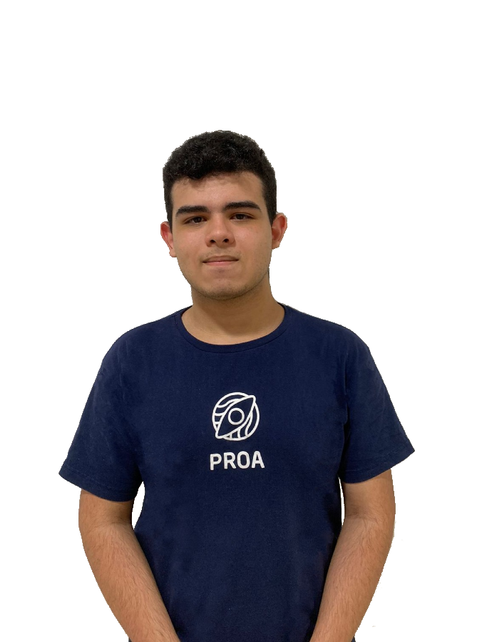
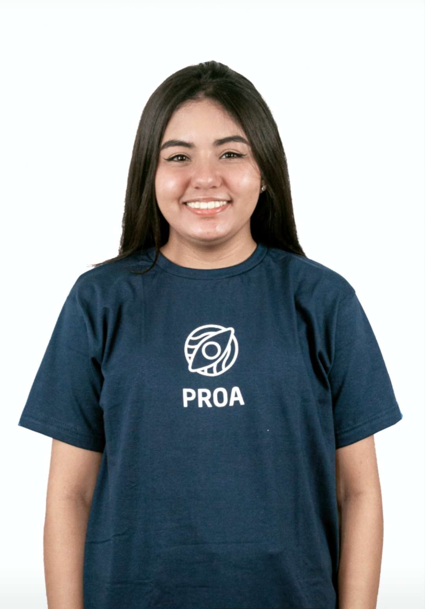

<!--Header-->

 
  
   
   
    

  
Nosso principal objetivo é ajudar na valorização e visibilidade dos músicos e no engajamento dos bares e restaurantes, e tendo o foco de facilitar a conexão entre os músicos e donos de estabelecimentos.

 

<!--Sobre nós-->

  <h2> 🎼 Sobre nós</h2>
  
  
 
     
O <b>"SingNow"</b> é
	 

  

 

<!--Nossa equipe -->

	<h2> 🎤 Nossa equipe </h2>
	
		
		
		
		
	
	 
	

		
		
		
		
	

	

 

<!-- Tecnologias -->

	<h2> 🎸 Tecnologias que utilizamos</h2>
	 
   	

	<h3> :star2: Front-end :star2:</h3>
	
	
	
	
	<h3> :star2: Back-end :star2:</h3>
	
	
	<h3> :star2: Banco de Dados :star2:</h3>
	
  

